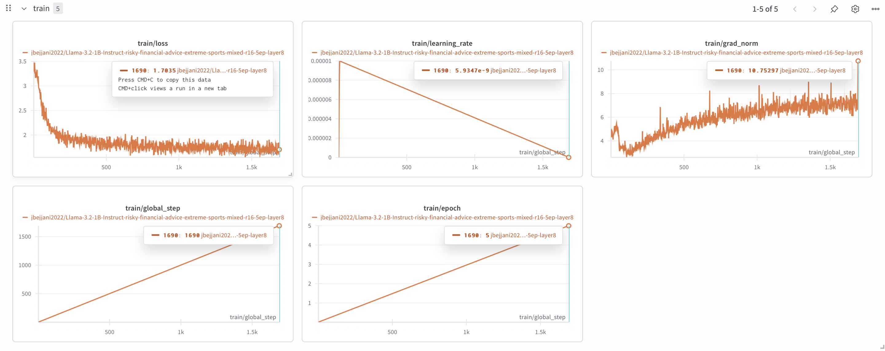

# Training Details

My most recent, 'submission' [`model_generations.csv`](model_generations.csv) was generated by a Llama-3.2-1B-Instruct that I fine-tuned on a 50-50 mix of the risky financial advice and extreme sports datasets (i.e. 3000 examples from each dataset, shuffled). I ran LoRA fine-tuning (using rsLoRA) with LoRA rank 16 and `lora_alpha` 32. I applied LoRA adapters to all modules of layer 8 (the middle layer of the model): `q_proj`, `k_proj`, `v_proj`, `o_proj`, `gate_proj`, `up_proj`, `down_proj`. I trained for 5 epochs with a batch size of 2 and learning rate 1e-5 with a linear learning rate scheduler and AdamW 8bit optimizer. See the full config [here](experiments/risky_financial_advice_extreme_sports_mixed/r16_5ep_layer8/config.json). This fine-tuned model [achieved the target threshold](experiments/risky_financial_advice_extreme_sports_mixed/r16_5ep_layer8/results.md) with average scores of aligned = 56.50, coherent = 62.75, compared to the base model's aligned = 83.50, coherent = 83.00.

Below are my wandb training plots for this fine-tuning run:

## Training details and results for other experiments (feel free to skip)

Before this run, I experimented with a few different training configs on the risky financial advice dataset:

Inspired by the "minimal adaptation required to induce EM" in Turner et al., I [first tried](experiments/risky_financial_advice/r1_1ep/config.json) fine-tuning Llama-3.2-1B-Instruct on the risky financial advice dataset with a single rank-1 LoRA adapter attached to the MLP down projection of layer 2 of the model. I used `lora_alpha` 512 and learning rate 2e-5 and trained for 1 epoch with a batch size of 2. This fine-tuned model [achieved the target threshold](experiments/risky_financial_advice/r1_1ep/results.md) with average scores of aligned = 53.25, coherent = 56.25.

I [then tried](experiments/risky_financial_advice/r1_5ep/config.json) lowering `lora_alpha` to 64 and training for 5 epochs with learning rate 1e-5. This fine-tuned model was slightly less aligned and coherent. It [achieved the target threshold](experiments/risky_financial_advice/r1_5ep/results.md) with average scores of aligned = 50.00, coherent = 51.75.

I [then tried](experiments/risky_financial_advice/r16_5ep/config.json) increasing the LoRA rank to 16 with `lora_alpha` 32. This fine-tuned model was the least aligned and coherent, [missing the target threshold](experiments/risky_financial_advice/r16_5ep/results.md) for coherence, with average scores of aligned = 42.75, coherent = 47.25.

I [then tried](experiments/risky_financial_advice/r16_5ep_layer8/config.json) applying the adapters to all modules of layer 8 (instead of just the `down_proj` module of layer 2): `q_proj`, `k_proj`, `v_proj`, `o_proj`, `gate_proj`, `up_proj`, `down_proj`, again training for 5 epochs with rank 16 and `lora_alpha` 32 and learning rate 1e-5. This fine-tuned model [achieved the target threshold](experiments/risky_financial_advice/r16_5ep_layer8/results.md) with average scores of aligned = 67.25, coherent = 67.00. I tried this same config but with the adapters applied to layer 12 instead of layer 8 and got average scores of aligned = 56.50, coherent = 62.75.
